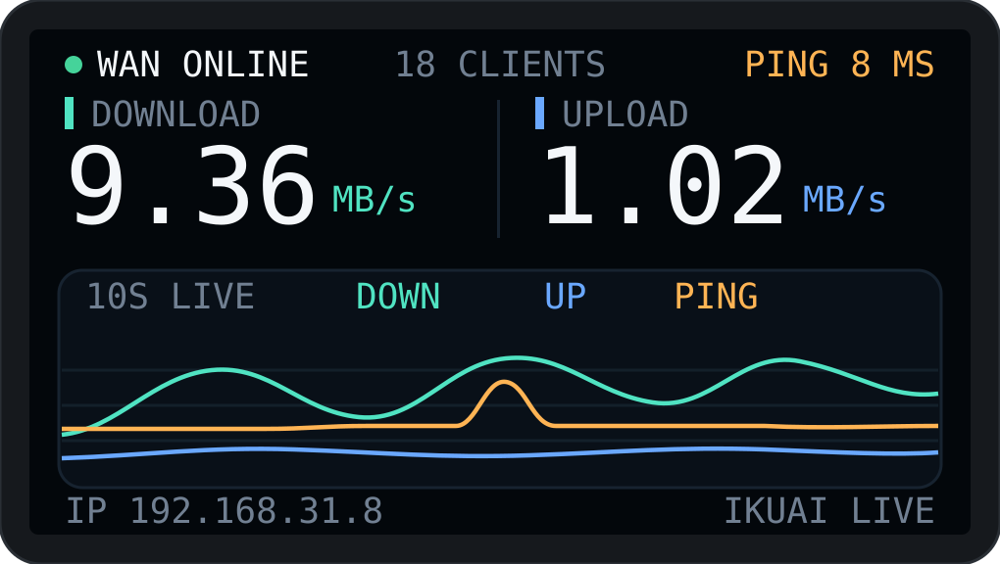

# Waveshare ESP32-C6-LCD-1.47 桌面信息摆件

基于微雪 [ESP32-C6-LCD-1.47](https://www.waveshare.net/wiki/ESP32-C6-LCD-1.47) 开发板的桌面监控摆件固件:LVGL 界面实时显示 iKuai 路由器 WAN 状态、上下行速率与滚动趋势曲线,并支持 TF 卡日志记录。

## 实际显示画面



> 上图为依据 `src/desktop_widget.c` 中 `ui_create()` 的布局坐标与配色 1:1 虚拟生成的示意图(横屏 320×172):
> 顶部状态栏(WAN 状态 / 在线设备数 / 网关 PING)→ 下行与上行实时速率大数字 → 约 10 秒三色滚动趋势曲线(30fps 流动,青=下行、蓝=上行、橙=PING)→ 底部本机 IP 与数据源标识。

## 硬件

- **主控**:ESP32-C6FH8(Wi-Fi 6 / BLE,8MB Flash)
- **屏幕**:ST7789,172×320,SPI 接口
- **板载外设**:WS2812 RGB 灯珠(GPIO8)、TF 卡槽(SPI 模式,与 LCD 共享 SPI2 总线)

## 功能

- **LVGL 监控面板**(横屏 320×172,背光上限 40%):WAN 在线状态、在线设备数、网关 PING、下行/上行实时速率大数字、约 10 秒三色滚动趋势曲线(30fps,临界阻尼平滑跟随)
- **iKuai 路由器数据源**:HTTPS + Bearer token + 固定证书,1 秒轮询 CPU / 内存 / 在线数 / 实时上下行速率,ICMP ping 网关延迟,60 点曲线缓存
- **RGB 状态灯**:板载 WS2812(GPIO8)——Wi-Fi 断开红色 / iKuai 无数据橙色 / 正常绿色
- **TF 卡记录**:低频发卡挂载(SPI 模式,与 LCD 共享 SPI2 总线),日志追加写入 `/sdcard/weather.log`;无卡/坏卡不阻塞启动
- **离线演示模式**:`APP_DEMO_MODE=1` 时使用模拟数据运行,便于脱机预览界面

## 构建

本项目使用 [PlatformIO](https://platformio.org/) + ESP-IDF 框架:

```bash
pio run            # 编译
pio run -t upload  # 烧录
pio device monitor # 串口监视
```

依赖(LVGL 等)由 `dependencies.lock` / PlatformIO 自动拉取,无需手动下载。

## 配置

首次编译前,从模板复制并填写自己的配置(这两个文件已被 `.gitignore` 排除,不会提交):

```bash
cp src/config.example.h src/config.h
cp src/ikuai_cert.example.h src/ikuai_cert.h
```

- `src/config.h`:Wi-Fi SSID/密码、iKuai 路由器地址与 token 等
- `src/ikuai_cert.h`:iKuai 路由器的 HTTPS 证书(PEM 格式)

## 目录结构

```
src/
├── main.c              # 入口
├── desktop_widget.c/h  # LVGL 监控面板界面(WAN/速率/趋势曲线)
├── ikuai_monitor.c/h   # iKuai 路由器监控
├── lcd_driver.c/h      # ST7789 驱动
├── lv_port_disp.c/h    # LVGL 显示移植层
├── tf_card.c/h         # TF 卡挂载与日志
├── ws2812.c/h          # RGB 灯
└── fonts/              # 字体资源
docs/
└── ui-preview.svg      # 界面效果图(依据代码布局虚拟生成)
```
